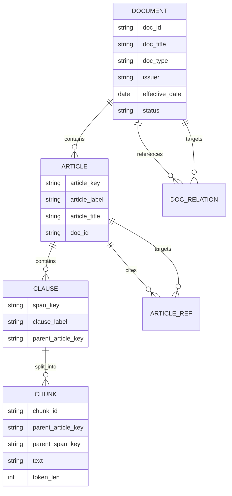
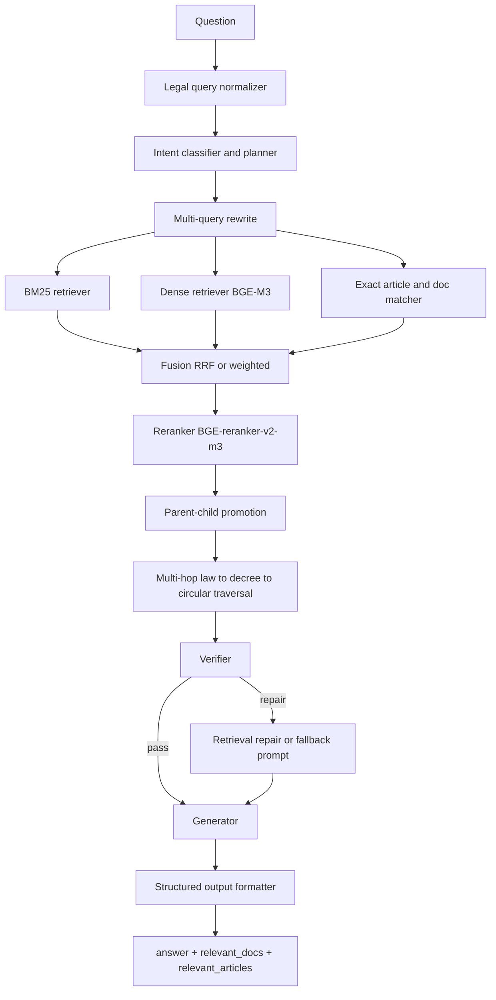

# Thiết kế hệ thống Legal RAG sẵn sàng thi đấu cho bài toán hỏi đáp pháp luật tiếng Việt

## Tóm tắt điều hành

Bài toán của bạn không phải là một chatbot pháp lý chung chung, mà là một hệ thống **Legal RAG theo chuẩn chấm thi**: đầu ra bắt buộc phải có `answer`, `relevant_docs`, `relevant_articles`; trong `answer` phải xuất hiện đúng các mẫu **“Điều X”** vì hệ thống chấm tự động sẽ trích xuất trực tiếp từ câu trả lời để so sánh với đáp án; còn `relevant_docs` và `relevant_articles` phải theo đúng định dạng chuỗi mà ban tổ chức quy định. Bộ test do ban tổ chức cung cấp là file câu hỏi pháp lý, không có train/dev công khai; bộ đáp án chuẩn được giữ kín. Quy định mô hình cũng giới hạn ở **mô hình công khai, mở, dưới 14B, phát hành trước 2026-03-01**, và không được dùng model đóng như GPT-4o/Gemini. Đồng thời, tài liệu cuộc thi có **một điểm mâu thuẫn quan trọng**: một đoạn ghi “không được sử dụng dữ liệu bên ngoài trong bất kỳ bước xử lý nào”, nhưng một đoạn khác lại cho phép đội thi chủ động thu thập văn bản pháp luật, dữ liệu SME và open datasets. Vì vậy, thiết kế tốt nhất là theo hướng **conservative-by-design**: kiến trúc phải hoạt động tốt chỉ với kho văn bản pháp luật bạn tự mirror và index; mọi phần “fine-tune / external dataset” chỉ nên là tuỳ chọn sau khi hỏi lại ban tổ chức. fileciteturn0file1

Khuyến nghị cuối cùng của tôi là:

**Stack chính**  
**LlamaIndex + Qdrant + BM25 nội bộ + BGE-M3 + BGE-Reranker-v2-M3 + Qwen3-14B**.  
Lý do: LlamaIndex mạnh ở ingestion pipeline, node hierarchy, retriever composition, router/recursive retrieval và evaluation; Qdrant nhẹ, rất hợp local/offline và có hybrid/multivector/filtering/score threshold; BGE-M3 là một lựa chọn retrieval đa ngôn ngữ rất mạnh, hỗ trợ dense + sparse + multi-vector và ngữ cảnh dài; BGE-Reranker-v2-M3 là reranker đa ngôn ngữ gọn và dễ deploy; Qwen3-14B là mô hình generator/planner phù hợp giới hạn <14B, hỗ trợ đa ngôn ngữ và có chế độ thinking / non-thinking để cân bằng chất lượng và tốc độ. citeturn15view0turn15view1turn15view2turn15view4turn11view0turn11view1turn20view0turn21view2turn26view0turn22view0

**Stack dự phòng**  
**Haystack + OpenSearch + cùng bộ model retrieval/rerank/generation**.  
Lý do: Haystack có pipeline component hoá, rõ ràng cho production; OpenSearch có semantic/hybrid search, search pipeline, reranking và ingest processors cho chunking/embedding. Nhược điểm là nặng hơn đáng kể trên MacBook M4 Pro 48 GB, nhưng phù hợp nếu sau này bạn chuyển lên máy Linux/GPU hoặc muốn gom BM25 + vector + ranking pipeline về một backend duy nhất. citeturn5view0turn8view0turn9view5

**Điểm mấu chốt để ăn điểm** không nằm ở việc “LLM nào mạnh nhất”, mà nằm ở bốn quyết định kiến trúc:
- lưu **canonical article-level identity** cực chặt theo trục `mã văn bản | tên văn bản | Điều X`;
- dùng **hybrid retrieval thực sự** chứ không dense-only;
- có **parent-child retrieval** theo Điều/Khoản/Điểm và **multi-hop traversal** giữa Luật → Nghị định → Thông tư;
- có **verifier** chặn trích dẫn ảo, chặn mismatch giữa citation và evidence, và kiểm tra thiếu văn bản hướng dẫn cấp dưới. citeturn19academia7turn18academia1turn30academia3

Với phần cứng của bạn, một hệ thống như vậy là hoàn toàn khả thi trên máy local. `llama.cpp` hỗ trợ Apple Silicon như một “first-class citizen”, tối ưu qua ARM NEON, Accelerate và Metal, đồng thời hỗ trợ lượng tử hoá từ 1.5-bit đến 8-bit; `mlx-lm` cũng được thiết kế riêng cho Apple Silicon, hỗ trợ chạy local, convert/quantize và streaming. Điều này làm cho chiến lược **Qwen3-14B Q6/Q8 chạy local + retrieval/reranker chạy tuần tự** rất thực dụng trên MacBook M4 Pro 48 GB. citeturn35view0turn35view1turn35view3turn35view4

## Yêu cầu bài toán và các ràng buộc thiết kế

Tài liệu cuộc thi buộc file nộp phải chứa đầy đủ `id`, `question`, `answer`, `relevant_docs`, `relevant_articles`. `relevant_docs` phải có dạng `<mã văn bản>|<tên văn bản>`, còn `relevant_articles` phải có dạng `<mã văn bản>|<tên văn bản>|<điều>`. Tài liệu cũng nêu rõ hệ thống chấm sẽ **tự động trích xuất các mẫu “Điều X” từ trường `answer`** để so sánh với `relevant_articles` trong đáp án chuẩn. Điều này có hệ quả rất quan trọng: nếu hệ thống của bạn chỉ trả citations ở `relevant_articles` mà quên nhắc “Điều X” trong `answer`, bạn có thể mất điểm retrieval dù evidence đúng. fileciteturn0file1

Từ file test của ban tổ chức, có thể thấy bộ câu hỏi có quy mô lớn và bao phủ rộng nhiều miền pháp luật doanh nghiệp: hỗ trợ SME, lao động, BHXH, thuế, thương mại, hợp đồng, đấu thầu, logistics, sở hữu trí tuệ, kế toán, doanh nghiệp, v.v. Các câu hỏi đầu file tương đối “đặc tả một văn bản – một Điều”, nhưng về sau tăng mạnh độ dài và tính tổ hợp, thường đòi hỏi nối nhiều tầng căn cứ hoặc phân biệt tình huống thực tế phức tạp. Nói cách khác, đây không phải chỉ là bài “semantic search”, mà là bài **retrieval + legal grounding + evidence formatting**. fileciteturn0file0

Về quy định mô hình, tài liệu ghi rõ chỉ dùng mô hình mở/công khai dưới 14B và phát hành trước ngày 2026-03-01; đồng thời cấm các model đóng. Điểm này loại bỏ phương án “dùng API mạnh rồi chữa retrieval bằng prompting”. Hệ thống phải tối ưu hiệu quả retrieval, không thể dựa vào generator để suy diễn bù. fileciteturn0file1

Về dữ liệu, như đã nói, tài liệu có hai đoạn mâu thuẫn: một đoạn cấm dữ liệu ngoài trong mọi bước xử lý, nhưng phần “Data” lại cho phép thu thập văn bản pháp luật chính thống, dữ liệu SME và open datasets. Vì bạn đã xác định sẽ tự lấy dữ liệu từ **Thư viện Pháp luật và các nguồn tương tự**, phương án hợp lý nhất là:
- xem **văn bản quy phạm pháp luật đầy đủ + metadata** là nguồn tri thức chính;
- không dựa vào dữ liệu xã hội, diễn đàn, Reddit, Facebook trong final run;
- không fine-tune model trên dữ liệu ngoài cho đến khi xác nhận lại luật chơi;
- vẫn có thể dùng open datasets cho **đánh giá nội bộ / huấn luyện phụ** nếu ban tổ chức xác nhận cho phép. fileciteturn0file1

Ở mức kỹ thuật, ràng buộc phần cứng của bạn rất phù hợp với một hệ thống “local-first”: 48 GB unified memory đủ để chạy một generator 14B dạng q6/q8, cộng thêm một embedding model và một reranker nếu quản lý bộ nhớ hợp lý, nhất là khi retrieval models chạy tuần tự và embeddings được precompute offline. `llama.cpp` và `mlx-lm` đều hỗ trợ chiến lược này tốt trên Apple Silicon. citeturn35view0turn35view3

## Khảo sát stack RAG mã nguồn mở và các tham chiếu Legal RAG

### So sánh các stack và backend chính

| Thành phần | Điểm mạnh thực dụng cho Legal RAG tiếng Việt | Hạn chế chính | Mức phù hợp với bài thi | Độ phức tạp deploy | Nguồn |
|---|---|---|---|---|---|
| **LlamaIndex** | Có ingestion pipeline, documents/nodes, retrievers, routers, node postprocessors, evaluation modules và hỗ trợ local models; rất hợp cho chunk hierarchy và recursive retrieval theo Điều/Khoản/Điểm | Cần tự gắn thêm verifier và output contract cứng | **Rất cao** | Trung bình | citeturn15view0turn15view1turn15view2turn15view4 |
| **Haystack** | Khung pipeline module hoá, document stores, components/pipelines rõ ràng, thiên production | Parent-child / legal graph cần custom nhiều hơn | Cao | Trung bình đến cao | citeturn5view0turn5view1 |
| **LangChain** | Hệ sinh thái rất rộng, có tách indexing vs retrieval/generation, hỗ trợ nhiều vector stores kể cả Qdrant | Dễ “glue-code sprawl”; nếu build production retrieval compliance thì phải tự viết khá nhiều | Trung bình | Trung bình | citeturn14view2turn14view3 |
| **Qdrant** | Nhẹ, local/offline tốt; hỗ trợ filtering, hybrid queries, multivectors, relevance tooling, score threshold; có Qdrant Edge nhúng offline | BM25 kiểu search engine truyền thống không mạnh bằng OpenSearch/Elastic nếu bạn muốn full text stack thuần | **Rất cao** | Thấp | citeturn11view0turn11view1turn9view3turn9view4 |
| **Weaviate** | Hybrid search vector + BM25F, alpha weighting, thresholds, embedded mode | Nặng hơn Qdrant; hệ sinh thái cloud-first rõ hơn local-first | Trung bình đến cao | Trung bình | citeturn9view0turn4view0 |
| **Milvus** | Hỗ trợ dense/sparse/hybrid retrieval, có ví dụ BGE-M3 + WeightedRanker rất hợp hybrid | Quá nặng cho bài thi local nếu không cần scale lớn | Trung bình | Cao | citeturn10view0turn10view1turn10view2 |
| **OpenSearch** | Có semantic/hybrid search, search pipelines, reranking, text chunking / text embedding / sparse encoding ingest processors; hợp nếu gom hết vào một backend | JVM nặng, local Mac mệt hơn | Cao cho server, thấp hơn cho local | Cao | citeturn8view0turn9view5 |
| **Elasticsearch** | Có retrievers phong phú, RRF, re-ranker retriever, dense vector, sparse vector, semantic text; rất mạnh cho search engineering | License/backing model phức tạp hơn Qdrant/OpenSearch nếu bạn muốn stack “sạch OSS”; nặng | Cao cho doanh nghiệp, không tối ưu cho bài thi local | Cao | citeturn6view2turn32view0 |

Nhìn tổng thể, **Qdrant** nổi bật nhất cho bối cảnh của bạn vì nhẹ, hỗ trợ offline, payload filtering tốt, có hybrid/multivector, và không buộc bạn phải chấp nhận stack JVM cồng kềnh. **LlamaIndex** đi kèm Qdrant lại đặc biệt hợp với bài toán luật vì hỗ trợ node-based retrieval, routing và hierarchical retrieval rõ hơn LangChain/Haystack trong giai đoạn đầu. citeturn11view0turn15view1turn15view2

### Embedding và reranker phù hợp với tiếng Việt

| Nhóm | Model | Vì sao đáng dùng | Lưu ý | Nguồn |
|---|---|---|---|---|
| Embedding chính | **BAAI/bge-m3** | Hỗ trợ dense + sparse + multi-vector trong cùng một model, hơn 100 ngôn ngữ, input tới 8192 tokens; tác giả khuyến nghị pipeline hybrid retrieval + reranking | Rất hợp legal retrieval vì có thể tận dụng dense cho semantics và sparse cho exact lexical cues | citeturn20view0turn19academia7 |
| Embedding dự phòng | **Alibaba-NLP/gte-multilingual-base** | 75 ngôn ngữ, 8192 tokens, dense + sparse, 768 dim, phần cứng nhẹ hơn | Phù hợp khi muốn index/query nhanh hơn BGE-M3 | citeturn29view2turn29view3turn29view4 |
| Embedding dự phòng khác | **intfloat/multilingual-e5-large-instruct** | 100 ngôn ngữ, embedding 1024, khá mạnh | Bắt buộc thêm instruction prefix vào query; nếu quên sẽ giảm hiệu quả | citeturn29view0turn29view1 |
| Reranker chính | **BAAI/bge-reranker-v2-m3** | Multilingual, lightweight, fast inference, dễ deploy | Là lựa chọn rerank cân bằng nhất cho local | citeturn21view2 |
| Reranker phụ | **jina-reranker-v2-base-multilingual** | Cross-encoder multilingual, context dài 1024, hiệu quả tốt | License CC-BY-NC-4.0 không đẹp bằng stack Apache/MIT nếu bạn muốn thương mại hóa về sau | citeturn28view0 |

Nếu mục tiêu là **bài thi + local Mac + dễ dựng**, tôi không khuyên cố tìm một embedding “chuyên Việt” chưa được kiểm chứng rộng rãi bằng BGE-M3. Lý do không phải tiếng Việt không quan trọng, mà ngược lại: bài toán pháp lý cần cả **semantic similarity** lẫn **exact lexical/legal phrase matching**, và BGE-M3 hiện là một trong số ít model mở gói gọn cả ba chế độ dense/sparse/multivector rất thực dụng cho legal IR. citeturn20view0turn19academia7

### Những tham chiếu Legal RAG đáng học nhưng không nên copy nguyên xi

| Dự án / công trình | Giá trị học được | Vì sao không nên bê nguyên | Nguồn |
|---|---|---|---|
| **LegalGraphRAG** | Tư duy legal graph phân tầng và module auditor/verification rất hợp luật | Quá mới, tăng độ phức tạp lớn; nên học ý tưởng hierarchical graph + auditor, không nên triển khai full GraphRAG ngay vòng đầu | citeturn18academia1 |
| **Mina** | Chứng minh RAG đa ngôn ngữ + chain-of-tools thực sự hữu ích cho legal assistant ngôn ngữ nguồn lực thấp | Khác hệ thống pháp luật, khác mục tiêu chấm thi; giá trị lớn nhất là mô thức toolchain và multilingual strategy | citeturn18academia0 |
| **LawGPT** | Gợi ý hướng domain adaptation / legal specialization | Không phải legal RAG cho tiếng Việt; phù hợp làm tài liệu tham khảo tư duy domain model hơn là stack competition-ready | citeturn18academia2turn18academia3 |
| **Knowledge graph cho hồ sơ án và luật Việt Nam** | Rất đáng học cách dựng legal entity-relation graph cho luật Việt | Nên dùng như tầng relation graph đơn giản, không nên biến thành full KG system ngay từ đầu | citeturn30academia3 |

Kết luận khảo sát: **đừng đi theo hướng “all-in GraphRAG” ngay**, cũng đừng xây một stack tìm kiếm full enterprise nặng kiểu Elastic/OpenSearch nếu mục tiêu số một là tối đa hoá chất lượng trên máy local. Hãy dựng một **hybrid legal retrieval core thật chắc**, rồi thêm graph edges và verifier như các tầng tăng cường sau. citeturn18academia1turn30academia3

## Kiến trúc khuyến nghị cuối cùng

### Stack chính và stack dự phòng

| Vai trò | Stack chính | Stack dự phòng | Lý do chọn |
|---|---|---|---|
| Orchestration | **LlamaIndex** | **Haystack** | LlamaIndex hợp legal hierarchy hơn; Haystack tốt nếu muốn pipeline hóa production mạnh hơn |
| Vector DB | **Qdrant** | **OpenSearch** | Qdrant nhẹ và local-first; OpenSearch tốt khi chuyển lên server |
| Sparse retriever | **BM25 nội bộ trên field đã chuẩn hoá** | **BM25 / hybrid query trong OpenSearch** | Điều luật, số hiệu văn bản, cụm pháp lý cần lexical search rất mạnh |
| Dense embedding | **BGE-M3** | **GTE-multilingual-base** | BGE-M3 mạnh nhất cho hybrid legal IR; GTE nhẹ hơn |
| Reranker | **BGE-Reranker-v2-M3** | **Jina reranker v2 multilingual** | BGE license/triển khai sạch hơn với bài thi |
| Generator | **Qwen3-14B** | **Qwen2.5-14B-Instruct** | Qwen3 mạnh hơn và có thinking/no-thinking; Qwen2.5 ổn định format hơn |
| Optional hard-case reasoner | **Không bật mặc định** | **DeepSeek-R1-Distill-Qwen-14B** | Chỉ nên dùng như ablation / escalator cho ca khó, tránh tăng latency/verbosity |

Khuyến nghị của tôi là **không dùng một “RAG stack all-in-one” theo kiểu phụ thuộc hoàn toàn vào framework**. Hãy dùng framework làm lớp orchestration, nhưng các khối retrieval, verifier, formatter và scorer phải là module riêng do bạn kiểm soát. Với bài thi có định dạng scoring đặc thù, sự kiểm soát này quan trọng hơn “đẹp kiến trúc”. citeturn15view1turn15view2turn5view0

### Khuyến nghị model và lượng tử hoá trên MacBook M4 Pro 48 GB

| Model | Tham số / bối cảnh | Vai trò | Lượng tử hoá khuyến nghị | Ước tính bộ nhớ weights | Ghi chú triển khai |
|---|---|---|---|---|---|
| **Qwen3-14B** | 14.8B; 32K native, 128K với YaRN; hỗ trợ 119 ngôn ngữ/dialect, gồm tiếng Việt | Generator chính | **Q6** ưu tiên; Q8 nếu latency chấp nhận được | Q6 ≈ 11.1 GB; Q8 ≈ 14.8 GB | Dùng non-thinking mặc định; only escalate thinking mode cho ca khó | 
| **Qwen2.5-14B-Instruct** | 14.7B; 131K context, Apache 2.0 | Fallback generator | Q6 hoặc Q8 | Q6 ≈ 11.0 GB; Q8 ≈ 14.7 GB | Format ổn định, ít “over-reasoning” hơn |
| **DeepSeek-R1-Distill-Qwen-14B** | MIT; distill từ Qwen-base 14B | Hard-case escalator / judge phụ | Q6 | ~11 GB | Không bật mặc định vì dài dòng hơn |
| **BGE-M3** | 1024 dim; 8192 tokens; dense+sparse+multi-vector | Embedding/query encoder | FP16 hoặc INT8 nếu có pipeline phù hợp | nhỏ hơn nhiều so với 14B LLM | Precompute offline |
| **BGE-Reranker-v2-M3** | multilingual, lightweight | Rerank top-k | FP16/CPU/GPU tùy batch | vừa phải | Chạy trên 20–50 candidates/query |

Các con số bộ nhớ ở cột weights là **ước tính toán học từ số tham số × số bit lượng tử hoá**, chưa gồm KV cache và runtime overhead; thực tế nên dành biên thêm khoảng 3–8 GB cho ngữ cảnh, allocator và ứng dụng. Với 48 GB unified memory, một cấu hình an toàn là:
- generator 14B dạng q6;
- embedding và reranker không giữ resident đồng thời trên GPU nếu không cần;
- Qdrant chạy local riêng với index trên đĩa + cache RAM vừa phải.  
Các mô hình và thông số nguồn được trích từ model cards / blog chính thức của Qwen, DeepSeek, BGE và backend inference OSS. citeturn26view0turn21view3turn21view4turn21view5turn21view6turn27view0turn20view0turn21view2turn35view0turn35view3

### Cách chạy local thực dụng nhất

Nếu ưu tiên **chất lượng trên Apple Silicon**, hãy thử **MLX-LM** trước vì đây là runtime được xây riêng cho Apple silicon, hỗ trợ chạy local, quantize và streaming. Nếu ưu tiên **hệ sinh thái GGUF / dễ quản trị model / dễ benchmark**, dùng **llama.cpp**. `llama.cpp` tối ưu qua Metal trên Apple Silicon và hỗ trợ nhiều mức quantization; `mlx-lm` thì thuận tiện hơn nếu bạn muốn đóng gói quy trình inference hoàn toàn trong Python. citeturn35view0turn35view1turn35view3turn35view4

Nếu local không đủ hoặc cần batch throughput cao hơn, cloud fallback đúng tinh thần open-source không phải là API proprietary, mà là **self-host đúng cùng model OSS** trên Linux GPU với `vLLM` hoặc `SGLang` — đây cũng chính là hai deployment path được Qwen khuyến nghị. citeturn22view0turn26view0

## Lược đồ dữ liệu pháp luật và pipeline truy hồi

### Lược đồ canonical cho văn bản luật

Hệ thống của bạn nên quản lý **ba lớp định danh** song song:

- **Document identity**: `doc_id = "80/2021/NĐ-CP"`, `doc_title`, `doc_type`, `issuer`, `effective_date`, `status`, `source_url`.
- **Article identity**: `article_key = "80/2021/NĐ-CP|Nghị định ...|Điều 5"`.
- **Span identity**: `span_key = "80/2021/NĐ-CP|Điều 5|Khoản 2|Điểm a"`.

Không được để retrieval chỉ lưu raw chunks vô danh. Nếu bạn không có canonical article key, bạn sẽ rất khó:
- map chunk → Điều đúng,
- sinh `relevant_articles` đúng format,
- verifier citation mismatch,
- dedupe nhiều chunk thuộc cùng một Điều,
- thực hiện multi-hop theo quan hệ văn bản.  
Đây là chỗ rất nhiều RAG “demo đẹp” nhưng “thi không ăn điểm”. Định dạng đầu ra cuộc thi càng làm yêu cầu canonical ID trở nên bắt buộc. fileciteturn0file1

### Quy tắc chunking theo Điều, Khoản, Điểm

Tôi khuyến nghị chunking theo bốn tầng:

| Tầng | Đơn vị lưu | Mục đích chính |
|---|---|---|
| Document node | toàn văn bản + metadata + quan hệ | filter theo văn bản, multi-hop graph |
| Article node | toàn **Điều** | đơn vị chấm điểm `relevant_articles`, đơn vị citation chuẩn |
| Clause node | **Khoản** thuộc Điều | tăng precision cho câu hỏi cụ thể |
| Micro-chunk | cửa sổ 220–320 tokens từ khoản dài, overlap 40–60 | tăng recall cho dense retrieval / reranking |

Quy tắc thực thi:
1. **Luôn lưu full Điều** như một node riêng, kể cả khi bạn tách khoản.  
2. Nếu Điều ngắn, dùng luôn Điều làm chunk truy hồi chính.  
3. Nếu Điều dài, tạo clause nodes và micro-chunks; nhưng mỗi child phải giữ `parent_article_key`.  
4. Text của child chunk phải được **prefix ngữ cảnh pháp lý**: loại văn bản, số hiệu, tên văn bản, chương, Điều, Khoản, Điểm.  
5. Với câu hỏi cần trả lời cụ thể, retriever lấy child chunk; với output cuối, system promote lại **article node làm evidence chính**.  

Đó là lý do tôi khuyên dùng LlamaIndex: node hierarchy, router, recursive retrieval và auto-merging logic hợp kiểu thiết kế này hơn hẳn một vector store phẳng. citeturn15view1turn15view2

### JSON schema khuyến nghị

```json
{
  "doc_id": "80/2021/NĐ-CP",
  "doc_title": "Nghị định Quy định chi tiết và hướng dẫn thi hành một số điều của Luật Hỗ trợ doanh nghiệp nhỏ và vừa",
  "doc_type": "Nghị định",
  "issuer": "Chính phủ",
  "issue_date": "2021-08-26",
  "effective_date": "2021-10-15",
  "status": "effective",
  "source_system": "TVPL",
  "source_url": "internal://mirror/80-2021-ND-CP",
  "language": "vi",
  "version": 1,
  "relations": {
    "guides_law_ids": ["04/2017/QH14"],
    "amends_doc_ids": [],
    "replaced_by": [],
    "references": [
      {
        "target_doc_id": "04/2017/QH14",
        "target_article": "Điều 5",
        "relation_type": "guides"
      }
    ]
  },
  "articles": [
    {
      "article_key": "80/2021/NĐ-CP|Nghị định Quy định chi tiết và hướng dẫn thi hành một số điều của Luật Hỗ trợ doanh nghiệp nhỏ và vừa|Điều 5",
      "article_label": "Điều 5",
      "article_title": "Nội dung hỗ trợ",
      "text": "...",
      "children": [
        {
          "span_key": "80/2021/NĐ-CP|Điều 5|Khoản 1",
          "level": "khoan",
          "label": "Khoản 1",
          "text": "...",
          "micro_chunks": [
            {
              "chunk_id": "80/2021/NĐ-CP|Điều 5|Khoản 1|#0",
              "start_char": 0,
              "end_char": 910,
              "text": "...",
              "metadata": {
                "doc_id": "80/2021/NĐ-CP",
                "article_label": "Điều 5",
                "parent_article_key": "80/2021/NĐ-CP|Nghị định Quy định chi tiết và hướng dẫn thi hành một số điều của Luật Hỗ trợ doanh nghiệp nhỏ và vừa|Điều 5",
                "legal_level": "nghi_dinh"
              }
            }
          ]
        }
      ]
    }
  ]
}
```

### Sơ đồ quan hệ dữ liệu

Sơ đồ dưới đây là dạng graph đơn giản vừa đủ cho multi-hop retrieval; không cần dựng GraphRAG đầy đủ ở vòng đầu. Ý tưởng này cũng gần với hướng “hierarchical legal graph” trong LegalGraphRAG và các nghiên cứu knowledge graph pháp luật Việt Nam, nhưng nhẹ hơn nhiều để dễ thi công. citeturn18academia1turn30academia3



### Pipeline hybrid retrieval đề xuất

Pipeline retrieval nên có bảy bước cứng:

1. **Normalize legal query**  
   Chuẩn hoá Unicode, số hiệu văn bản, alias loại văn bản, “Điều/Khoản/Điểm”, loại bỏ nhiễu nhưng giữ token pháp lý.
2. **Query planner**  
   Phân loại ý định: điều kiện, định nghĩa, thủ tục/hồ sơ, thời hạn, xử phạt, quyền/nghĩa vụ, tính mức, tranh chấp/hợp đồng, v.v.
3. **Multi-query rewrite**  
   Tạo tối đa 3 truy vấn:
   - bản gốc,
   - bản pháp lý hóa,
   - bản mở rộng đồng nghĩa / văn bản hướng dẫn.
4. **Candidate generation**  
   - BM25 top 40  
   - dense top 60  
   - exact-hit top 20 cho số hiệu văn bản / Điều / cụm “Luật…”, “Nghị định…”
5. **Fusion + rerank**  
   RRF hoặc weighted fusion → top 50 → rerank về top 12–15.
6. **Parent-child promotion**  
   Nâng chunk -> article; dedupe theo `article_key`.
7. **Multi-hop traversal**  
   Nếu câu hỏi là thủ tục/xử phạt/triển khai, đi thêm 1–2 cạnh sang nghị định/thông tư hướng dẫn.

Các ngưỡng khởi điểm nên dùng:
- `BM25_top_k = 40`
- `dense_top_k = 60`
- `fusion_top_k = 50`
- `rerank_keep = 12`
- `score_threshold` cho dense/Qdrant khoảng 0.15–0.20 rồi tune dần trên dev set
- nếu top rerank quá thấp hoặc evidence thuộc nhiều văn bản xung đột, bật verifier/repair pass.

Qdrant có filtering, hybrid queries, score threshold và multivector tooling; OpenSearch/Weaviate/Milvus đều có hybrid patterns, nhưng Qdrant cho local build gọn nhất. BGE-M3 lại được thiết kế đúng tinh thần hybrid + reranking. citeturn11view1turn11view2turn11view3turn9view3turn9view4turn8view0turn9view0turn10view0turn20view0



### Output formatting để tối đa hoá điểm

Do scoreboard tự động extract “Điều X” từ `answer`, template câu trả lời nên có cấu trúc gần như cố định:

**Mẫu an toàn**
1. Kết luận ngắn gọn, đúng trọng tâm.  
2. 1–3 câu triển khai.  
3. Dòng căn cứ rõ ràng:  
   `Căn cứ: Điều 4 Luật ...; Điều 5 Luật ...; Điều 5 Nghị định ...`

Nếu bạn cần nói “Khoản 2 Điều 5”, thì vẫn phải để **“Điều 5” xuất hiện nguyên mẫu** trong câu trả lời. Đây là chi tiết nhỏ nhưng cực đắt giá cho hệ thống chấm tự động. fileciteturn0file1

## Đánh giá, verifier và chính sách an toàn

### Harness đánh giá nội bộ nên được chia làm hai lớp

Lớp thứ nhất là **structural validation** theo đúng competition contract:
- đủ 2000 dòng hay không,
- đúng `id/question/answer/relevant_docs/relevant_articles`,
- format chuỗi có đúng không,
- `answer` có chứa ít nhất một “Điều X” khi cần hay không.  
Lớp này bám sát file organizer và phải chạy ở mỗi commit trước khi sinh submission. fileciteturn0file0turn0file1

Lớp thứ hai là **quality evaluation**:
- retrieval quality: Precision / Recall / F2 macro ở article-level;
- citation accuracy: % citation trong answer trùng article thật trong KB;
- supported answer ratio: % câu trả lời mà mọi citation đều có evidence được truy hồi;
- hallucination rate: % câu trả lời có citation không nằm trong retrieved set hoặc không tồn tại trong KB;
- format stability: % mẫu output hợp lệ;
- latency và throughput.  

Tài liệu cuộc thi mô tả đánh giá retrieval bằng Precision, Recall và **F2 macro**, còn phần answer dùng LLM-as-a-Judge và một phần đánh giá thủ công bởi chuyên gia pháp luật. Điều này có nghĩa là bạn không thể chỉ tối ưu lexical hit; bạn phải tối ưu cả **grounded answer quality**. fileciteturn0file1

### Cách dùng file test của ban tổ chức cho đánh giá

Vì file organizer là **test-only** và không có đáp án công khai, bạn không thể tính F2 thật trên toàn bộ 2000 câu chỉ từ file này. Cách đúng là:
- dùng toàn bộ 2000 câu làm **regression set** cho format, latency, distribution shift;
- trích mẫu phân tầng 150–300 câu, tự gán gold `relevant_docs` / `relevant_articles` thành **dev set nội bộ**;
- giữ một tập “hard set” riêng cho các câu đa-hop, xử phạt, thủ tục, và câu dài.  

Nếu quy định dữ liệu ngoài được xác nhận là cho phép, bạn có thể tăng dev set bằng cách tận dụng văn bản luật + annotation nội bộ; nếu không, vẫn có thể chỉ annotate thủ công từ chính bộ câu hỏi ban tổ chức. fileciteturn0file0turn0file1

### Bảng scenario cần so sánh định kỳ

| Scenario | Retrieval | Rerank | Multi-hop | Verifier | Metric chính |
|---|---|---|---|---|---|
| S0 | BM25 only | Không | Không | Không | P/R/F2 article-level |
| S1 | Dense only | Không | Không | Không | Recall@k, F2 |
| S2 | BM25 + Dense fusion | Không | Không | Không | F2, format stability |
| S3 | Hybrid | Có | Không | Không | F2, citation accuracy |
| S4 | Hybrid | Có | Có | Không | F2 khó, multi-doc coverage |
| S5 | Hybrid | Có | Có | Có | hallucination rate, supported answer ratio |
| S6 | S5 + answer repair | Có | Có | Có | final submission validity + LLM-judge nội bộ |

Nếu chỉ được làm một ablation tối quan trọng, hãy so **S2 vs S5**. Chênh lệch giữa hai cấu hình này sẽ cho bạn biết verifier và multi-hop có thật sự đáng công trong dữ liệu của ban tổ chức hay không.

### Thiết kế verifier

Verifier không nên là “LLM judge thứ hai” ngay từ đầu. Tôi khuyên dùng **rules-first verifier**, sau đó mới thêm một pass ngắn bằng LLM nếu cần. Verifier nên kiểm tra tối thiểu bốn lỗi:

1. **Hallucinated citation**  
   `answer` nêu “Điều X” nhưng article đó không tồn tại trong KB hoặc không nằm trong candidate set sau rerank/promote.
2. **Citation-evidence mismatch**  
   `relevant_articles` ghi Điều 5 nhưng evidence text thực ra thuộc Điều 6 hoặc article_key sai title/doc_id.
3. **Missing lower-level guidance**  
   Câu hỏi là thủ tục / hồ sơ / mức phạt / biểu mẫu / triển khai, nhưng retrieval chỉ có luật gốc mà không có nghị định/thông tư hướng dẫn dù graph cho thấy có văn bản hướng dẫn.
4. **Answer unsupported**  
   Nội dung kết luận không được bất kỳ evidence chunk nào support trực tiếp.

### Pseudocode cho verifier

```python
def verify_answer(query, draft_answer, retrieved_articles, retrieved_docs, kb, intent):
    cited_articles = extract_article_patterns(draft_answer)  # ["Điều 4", "Điều 5", ...]
    flags = []

    # 1. citation must map to canonical article keys
    mapped = []
    for cited in cited_articles:
        candidates = [a for a in retrieved_articles if a.article_label == cited]
        if not candidates:
            kb_hits = kb.lookup_by_article_label(cited)
            if not kb_hits:
                flags.append(("hallucinated_citation", cited))
            else:
                flags.append(("citation_not_retrieved", cited))
        else:
            mapped.extend(candidates)

    # 2. ensure relevant_articles are a subset of mapped evidence
    canonical_relevant_articles = []
    for art in dedupe_by_article_key(mapped):
        canonical_relevant_articles.append(
            f"{art.doc_id}|{art.doc_title}|{art.article_label}"
        )

    # 3. check missing lower-level docs for implementation-style questions
    if intent in {"thu_tuc", "ho_so", "xu_phat", "muc_phat", "bieu_mau"}:
        if not has_guidance_doc(retrieved_docs):
            if has_guidance_edges_from(retrieved_docs, kb):
                flags.append(("missing_guidance_doc", None))

    # 4. unsupported factual spans
    unsupported_spans = detect_unsupported_claims(draft_answer, retrieved_articles)
    if unsupported_spans:
        flags.append(("unsupported_claims", unsupported_spans))

    # 5. decision policy
    if any(f[0] in {"hallucinated_citation", "unsupported_claims"} for f in flags):
        return {
            "status": "repair",
            "flags": flags,
            "canonical_relevant_articles": canonical_relevant_articles
        }

    if len(canonical_relevant_articles) == 0:
        return {
            "status": "fallback",
            "flags": flags + [("no_canonical_articles", None)],
            "canonical_relevant_articles": []
        }

    return {
        "status": "pass",
        "flags": flags,
        "canonical_relevant_articles": canonical_relevant_articles
    }
```

### Chính sách hỏi làm rõ

Trong **chế độ tương tác**, hệ thống nên hỏi làm rõ khi thiếu facts đầu vào mang tính quyết định, ví dụ:
- doanh nghiệp thuộc loại hình nào,
- hành vi xảy ra khi nào,
- tại Việt Nam hay giao dịch xuyên biên giới,
- quy mô lao động / doanh thu / phương thức thuế.  

Nhưng trong **chế độ thi batch**, hệ thống không thể hỏi lại. Khi đó policy phải là:
- trả lời theo **quy định chung**,
- nêu rõ “trong trường hợp không có thông tin bổ sung…”,
- chỉ cite những Điều có support chắc.  

Điều này giảm nguy cơ hallucination và giảm sai lệch do suy đoán facts không có trong đề.

## Kế hoạch triển khai và nội dung IDEA.md

### Lộ trình triển khai theo pha

| Pha | Mục tiêu | Deliverable | Ước lượng cho 1 dev |
|---|---|---|---|
| Pha nền | Parser + schema + canonical IDs | `parser/`, `schemas/`, bộ JSONL article nodes | 4–6 ngày |
| Pha indexing | Hybrid index dense + BM25 + metadata graph | `index/`, `qdrant/`, `bm25/` | 3–5 ngày |
| Pha retrieval | planner, multi-query, fusion, rerank, promote | `retrieval/` | 5–7 ngày |
| Pha generation | prompting, formatting, citation mapping | `generation/` | 3–4 ngày |
| Pha verifier | citation check, repair loop, fallback policy | `verifier/` | 3–5 ngày |
| Pha evaluation | regression runner, dev scorer, submission validator | `eval/` | 4–6 ngày |
| Pha hardening | profiling, caching, failure handling, CLI | `service/`, `scripts/` | 3–5 ngày |

Một MVP tốt có thể dựng trong khoảng **3 tuần full-time**. Một bản “đủ thi + đủ sạch + có verifier + có harness” sẽ thực tế hơn ở mức **4–5 tuần** cho một người. Đây là estimate kỹ thuật, không phải cam kết lịch cứng.

### Cấu trúc thư mục khuyến nghị

```text
legal-rag/
├─ configs/
│  ├─ base.yaml
│  ├─ local_m4.yaml
│  └─ prod.yaml
├─ data/
│  ├─ raw/
│  ├─ normalized/
│  ├─ chunks/
│  ├─ indices/
│  └─ submissions/
├─ legal_rag/
│  ├─ parser/
│  ├─ normalize/
│  ├─ schemas/
│  ├─ graph/
│  ├─ index/
│  ├─ retrieval/
│  ├─ rerank/
│  ├─ generation/
│  ├─ verifier/
│  ├─ formatting/
│  ├─ eval/
│  ├─ cli/
│  └─ utils/
├─ tests/
│  ├─ unit/
│  ├─ integration/
│  └─ fixtures/
├─ notebooks/
├─ scripts/
├─ IDEA.md
├─ pyproject.toml
└─ README.md
```

### CLI khuyến nghị

```bash
python -m legal_rag.cli.ingest \
  --input_dir data/raw \
  --output_dir data/normalized

python -m legal_rag.cli.build_index \
  --config configs/local_m4.yaml \
  --input_dir data/normalized \
  --qdrant_path data/indices/qdrant

python -m legal_rag.cli.run_batch \
  --config configs/local_m4.yaml \
  --questions /mnt/data/R2AIStage1DATA.json \
  --output data/submissions/results.json

python -m legal_rag.cli.eval_dev \
  --pred data/submissions/dev_results.json \
  --gold data/dev/gold.json

python -m legal_rag.cli.validate_submission \
  --input data/submissions/results.json
```

### Nội dung IDEA.md sẵn để đưa cho Codex

Nội dung dưới đây bám theo khuyến nghị stack, output contract của cuộc thi và các thành phần retrieval/verifier đã nêu ở trên. Nó được viết để dùng trực tiếp như một blueprint implementation. Contract đầu ra của competition và yêu cầu citation “Điều X” lấy từ tài liệu ban tổ chức; lựa chọn LlamaIndex/Qdrant/BGE-M3/Qwen3 dựa trên tài liệu chính thức của các dự án tương ứng. fileciteturn0file1 citeturn15view1turn11view0turn20view0turn26view0

```markdown
# IDEA.md

## Mục tiêu

Xây dựng hệ thống Legal RAG tiếng Việt cho competition với output bắt buộc:

```json
{
  "id": 1,
  "question": "...",
  "answer": "... Điều X ...",
  "relevant_docs": ["<mã văn bản>|<tên văn bản>"],
  "relevant_articles": ["<mã văn bản>|<tên văn bản>|<Điều X>"]
}
```

## Nguyên tắc thiết kế

- Retrieval-first, generation-second.
- Không để LLM tự bịa citation.
- Mọi câu trả lời phải map được về canonical article keys.
- Parent-child retrieval bắt buộc.
- Multi-hop law -> decree -> circular là optional nhưng được bật theo intent.
- Verifier chạy trước khi format output cuối.

## Tech stack

- Python 3.11+
- LlamaIndex cho orchestration retrieval
- Qdrant cho dense vector store
- BM25 nội bộ cho sparse lexical retrieval
- BAAI/bge-m3 cho embeddings
- BAAI/bge-reranker-v2-m3 cho reranking
- Qwen3-14B hoặc Qwen2.5-14B-Instruct cho generation
- MLX-LM hoặc llama.cpp cho local inference trên Mac

## Module interfaces

### `legal_rag.schemas.models`

```python
class Question(TypedDict):
    id: int
    question: str

class RetrievedChunk(TypedDict):
    chunk_id: str
    doc_id: str
    doc_title: str
    article_key: str
    article_label: str
    score_dense: float | None
    score_bm25: float | None
    score_fused: float | None
    score_rerank: float | None
    text: str
    metadata: dict

class RetrievalResult(TypedDict):
    query: str
    intent: str
    rewrites: list[str]
    chunks: list[RetrievedChunk]
    docs: list[dict]
    articles: list[dict]
    confidence: float

class FinalPrediction(TypedDict):
    id: int
    question: str
    answer: str
    relevant_docs: list[str]
    relevant_articles: list[str]
```

### `legal_rag.parser`

- Input: full-text law documents with metadata.
- Output: normalized JSONL with document/article/clause/chunk hierarchy.

Functions:
- `parse_document(raw_doc) -> ParsedDocument`
- `split_articles(parsed_doc) -> list[ArticleNode]`
- `split_clauses(article_node) -> list[ClauseNode]`
- `make_micro_chunks(clause_node) -> list[ChunkNode]`

### `legal_rag.index`

- `build_dense_index(chunks, qdrant_client, embedder)`
- `build_bm25_index(chunks, path)`
- `build_relation_graph(parsed_documents)`

### `legal_rag.retrieval`

- `classify_intent(question) -> str`
- `rewrite_queries(question, intent) -> list[str]`
- `retrieve_bm25(queries, top_k) -> list[RetrievedChunk]`
- `retrieve_dense(queries, top_k) -> list[RetrievedChunk]`
- `retrieve_exact(question) -> list[RetrievedChunk]`
- `fuse_results(bm25_hits, dense_hits, exact_hits) -> list[RetrievedChunk]`
- `rerank(question, hits, top_k) -> list[RetrievedChunk]`
- `promote_parent_articles(hits) -> tuple[list[dict], list[dict]]`
- `expand_multihop(question, articles, docs) -> tuple[list[dict], list[dict]]`

### `legal_rag.generation`

- `build_answer_prompt(question, retrieved_articles, retrieved_docs) -> str`
- `generate_answer(prompt, llm) -> str`
- `normalize_answer_citations(answer) -> str`

Generation rules:
- Answer ngắn, trực tiếp.
- Luôn có đoạn `Căn cứ: Điều X ...`
- Không vượt quá độ dài cấu hình.
- Không được nêu citation không có trong retrieved_articles.

### `legal_rag.verifier`

- `extract_article_patterns(answer) -> list[str]`
- `verify_answer(...) -> VerificationResult`
- `repair_answer(...) -> str`
- `canonicalize_relevant_docs(...) -> list[str]`
- `canonicalize_relevant_articles(...) -> list[str]`

### `legal_rag.formatting`

- `format_prediction(question, answer, docs, articles) -> FinalPrediction`
- `validate_prediction(pred) -> list[str]`
- `validate_submission_file(path) -> list[str]`

## Luồng chạy

1. Parse và chuẩn hóa luật.
2. Build article graph + chunks.
3. Build BM25 + dense index.
4. Với mỗi question:
   - classify intent
   - rewrite query
   - retrieve bm25 + dense + exact
   - fuse + rerank
   - promote articles
   - optional multi-hop
   - generate answer
   - verify
   - repair nếu cần
   - format output cuối
5. Validate JSON trước khi ghi file submission.

## Config quan trọng

```yaml
retrieval:
  bm25_top_k: 40
  dense_top_k: 60
  exact_top_k: 20
  fused_top_k: 50
  rerank_top_k: 12

chunking:
  article_max_tokens: 900
  micro_chunk_size: 280
  micro_chunk_overlap: 50

generation:
  max_new_tokens: 320
  temperature: 0.1
  force_citation_block: true

verifier:
  enable_repair: true
  require_at_least_one_article: true
  require_retrieved_support_for_every_citation: true
```

## Example unit tests

### `tests/unit/test_citation_parser.py`

```python
def test_extract_article_patterns():
    answer = "Doanh nghiệp được hỗ trợ theo Điều 4 và Điều 5 của Luật..."
    assert extract_article_patterns(answer) == ["Điều 4", "Điều 5"]
```

### `tests/unit/test_formatter.py`

```python
def test_format_prediction_schema():
    pred = format_prediction(
        {"id": 1, "question": "abc"},
        "Căn cứ: Điều 5 Luật X.",
        [{"doc_id": "01/2020/QH14", "doc_title": "Luật X"}],
        [{"doc_id": "01/2020/QH14", "doc_title": "Luật X", "article_label": "Điều 5"}],
    )
    assert pred["relevant_docs"] == ["01/2020/QH14|Luật X"]
    assert pred["relevant_articles"] == ["01/2020/QH14|Luật X|Điều 5"]
```

### `tests/unit/test_verifier.py`

```python
def test_verifier_detects_hallucinated_citation():
    answer = "Căn cứ: Điều 99 Luật X."
    result = verify_answer(
        query="...",
        draft_answer=answer,
        retrieved_articles=[],
        retrieved_docs=[],
        kb=fake_kb(),
        intent="dieu_kien",
    )
    assert result["status"] in {"repair", "fallback"}
```

### `tests/integration/test_batch_runner.py`

```python
def test_batch_runner_outputs_all_questions(tmp_path):
    output_path = tmp_path / "results.json"
    run_batch(
        input_questions="tests/fixtures/questions.json",
        output_path=str(output_path),
        config_path="configs/base.yaml",
    )
    data = json.loads(output_path.read_text())
    assert len(data) == 3
    assert all("answer" in x for x in data)
    assert all("relevant_docs" in x for x in data)
    assert all("relevant_articles" in x for x in data)
```

## Ưu tiên implementation

- Ưu tiên correctness của canonical IDs trước.
- Sau đó mới tối ưu retrieval.
- Sau đó mới tối ưu prompting.
- GraphRAG đầy đủ là phase sau, không phải MVP.

## Done criteria

- Chạy end-to-end trên file organizer.
- Output hợp lệ 100%.
- Không có citation ảo trên dev set.
- Hybrid + rerank outperform dense-only và bm25-only trên dev set.
```

### Checklist rủi ro và cách giảm thiểu

| Rủi ro | Biểu hiện | Giảm thiểu |
|---|---|---|
| Sai title văn bản | `relevant_docs` bị lệch format | Giữ exact official title trong canonical metadata, không tự viết tắt |
| Cite Điều đúng nhưng doc sai | `answer` nói Điều 5 nhưng map nhầm văn bản khác | Article key phải luôn bao gồm doc_id + doc_title + article_label |
| Dense retrieval bỏ sót article number | BM25 hit tốt nhưng dense hit kém | Luôn giữ BM25/exact-hit branch riêng |
| Generator bịa thêm căn cứ | answer dài, citation ảo | Verifier rules-first, answer template ngắn |
| Chỉ lấy luật, thiếu nghị định/thông tư | trả lời chung đúng nhưng không đủ thực tiễn | Intent-based multi-hop expansion |
| Local memory pressure | swap, tokens/s tụt | q6 thay vì q8, chạy tuần tự embedding/rerank/generation |
| Over-engineering GraphRAG | chậm tiến độ, khó debug | Chỉ dựng relation graph tối giản ở vòng đầu |

## Rủi ro, giới hạn và bước tiếp theo

Rủi ro lớn nhất hiện nay không phải kỹ thuật, mà là **diễn giải luật chơi**. Tài liệu cuộc thi vừa cấm “dữ liệu bên ngoài trong bất kỳ bước xử lý nào”, vừa cho phép đội thi tự thu thập văn bản pháp luật và open datasets. Nếu ban tổ chức xác nhận cách hiểu chặt, bạn nên dùng only-corpus strategy: chỉ index tập văn bản bạn coi là corpus chính thức cho run cuối, không fine-tune gì thêm. Nếu ban tổ chức xác nhận cách hiểu mở, bạn có thể mở rộng dev/eval bằng open legal datasets tiếng Việt như VLQA, nhưng tôi vẫn khuyên **không phụ thuộc vào external supervised fine-tuning** để tránh tăng rủi ro vận hành. fileciteturn0file1 citeturn30academia2

Giới hạn thứ hai là chưa có gold công khai cho 2000 câu hỏi organizer. Vì vậy, mọi tối ưu retrieval, threshold và prompt đều phải đi qua một **dev set tự gán nhãn** đủ đại diện. Nếu không có bước này, bạn sẽ rất dễ overfit theo “trực giác pháp lý” hoặc theo vài ví dụ lẻ trên dashboard. fileciteturn0file0turn0file1

Giới hạn thứ ba là mô hình 14B local vẫn không cứu được retrieval tệ. Các nghiên cứu legal RAG gần đây đều nhấn mạnh hai điều: cấu trúc tri thức phân tầng và verification/auditing mới là phần làm tăng độ tin cậy, không phải chỉ thay generator lớn hơn. Vì vậy, thứ tự ưu tiên đúng là: **canonical schema → hybrid retrieval → rerank → verifier → generation polish**. citeturn18academia1turn16academia1

Bước tiếp theo ngắn hạn mà tôi khuyên bạn thực hiện theo đúng thứ tự là:
1. Chốt **schema canonical** và parser Điều/Khoản/Điểm.  
2. Dựng **Qdrant + BM25** với khoảng 3–5 văn bản luật mẫu.  
3. Chạy **hybrid retrieval + rerank** trên 100 câu đại diện từ organizer file.  
4. Tạo **dev set gán nhãn** ít nhất 150 câu.  
5. Gắn **verifier** trước khi tối ưu prompt generator.  
6. Chỉ sau đó mới benchmark **Qwen3-14B vs Qwen2.5-14B** cho generation cuối.

Kết luận ngắn gọn: **kế hoạch sẵn sàng để đưa vào làm là có**, nhưng chỉ khi bạn hiểu rằng “production-ready cho competition” ở đây không phải là dựng stack lớn nhất, mà là dựng stack **ổn định nhất, kiểm chứng được nhất, và map được mọi câu trả lời về đúng `Điều X`**. Với ràng buộc hiện tại, lựa chọn hợp lý nhất là **LlamaIndex + Qdrant + BM25 + BGE-M3 + BGE-Reranker-v2-M3 + Qwen3-14B**, kèm một verifier rules-first và một harness đánh giá nội bộ thật chặt. citeturn15view1turn11view0turn20view0turn21view2turn26view0

